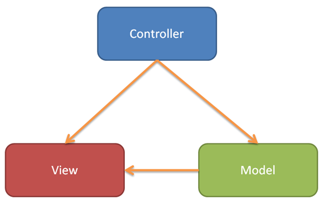

# Agile Application Development

## Introducción a AngularJS

### ¿Qué es AngularJS?

AngularJS es un framework Javascript para escribir aplicaciones que se ejecutan desde el browser. No es simplemente una aplicación para escribir frontend. Se podría escribir una aplicación completa sobre AngularJS simpre y cuando quiero que se ejecute completamente en el browser cliente.
Este tipo de aplicaciones están catalogadas como _Single Page_ y pueden implementar el patron de diseño MVC, o por lo menos se acerca bastante, para la interacción bidireccional entre el **frontend** y los controladores de esas vistas.

### ¿Por qué Javascript?

Javascript no es solo una moda, es excelente lenguaje el cual no se estaba teniendo en cuenta para este tipo de aplicación. La ventaja de Javascript es que corre nativamente sobre el _browser_, si necesidad de una compilación intermedia. El lenguaje tiene mezcla de paradigmas y nos da mucha potencia a la hora de escribir código. Es primordialmente prototipado, pero me permite escribir utilizar el paradigma funcional para escribir las funciones.

### Que es una aplicacion SinglePage?

En un punto anterior nombremos el concepto de _Single Page_. Cuando observaoms las aplicaciones tradicionales, por cada link, por cada redirección, o por cada opción que signifique un cambio en la pantalla, se debería volver a cargar el html generado. Esto volvía a las aplicaciones extremadamente lentas, porque por cada acción debía ir al servidor y traerse la página completa cada vez. Una primera solución fue la llegada de **AJAX** (Asyncronous Javascript and XML), que facilitaba la inyección de javascript en el browser, y así podía generar un _refresh_ parcial del fragmento de página deseado. Esta solución mejoró mucho el rendimiento y la usabilidad de los frontends, pero no era suficiento. Las aplicaciones _SinglePage_ se aprovechan de las bondades de Javascript para poder enviar toda la web completa el cliente, o por lo menos, el mecanismo necesario para que mediante Javascript los nuevos _HTML_ que necesite la aplicación se envien de manera mucho más liviana. Parece que la pagina cambia, y si, lo hace, pero no va a buscar el HTML al servidor, sino que lo cambia en runtime.


### Que ventaja tengo frente a otros frameworks?

La curva de aprendizaje de AngularJS es grande al principio, pero luego se convierte en un framework excepcional. Existen muchos sabores de frameworks, como **EmberJS**, **Batman.js**, **Backbone.js**, etc, etc. Cada uno tiene sus particularidades, pero la principal ventaja de AngularJS es que esta soportado por Google y por su comunidad, y que tiene muchos casos o manejos de memoria que otros frameworks todavía no resolvieron. La comunidad AngularJS es gigantesca, por lo que vamos a encontrar gran cantidad de frameworks que se acoplan y nos otorgan muchísimas posiblidades para mejorar nuestra aplicación.

## Requerimientos

* NPM: https://www.npmjs.com/
* Gulp: http://gulpjs.com/
* Jasmine: http://jasmine.github.io/
* KarmaJS: http://karma-runner.github.io/Bower: http://bower.io/

## Bootstrap del proyecto


### Primero, la estructura

```bash

mkdir avianca
mkdir avianca/app
touch avianca/app/index.html
touch avianca/app/app.js

```
### Luego, las dependencias


[https://github.com/angular/bower-angular/tree/v1.4.0-rc.1](https://github.com/angular/bower-angular/tree/v1.4.0-rc.1)
[https://github.com/angular/bower-angular-route](https://github.com/angular/bower-angular-route)


```bash
cd avianca

su -
yum install npm

npm install --global bower
npm install --global gulp
npm install --global karma-cli
npm install --global protractor

exit

npm install --save-dev gulp
npm install --save-dev gulp-serve
npm install --save-dev karma
npm install --save-dev karma-jasmine
npm install --save-dev karma-chrome-launcher
npm install --save-dev jasmine

bower install --save angularjs
bower install --save angular-route
bower install --save patternfly

npm init
bower init
```

## Modules


## Views

Para angular una vista es un _HTML_ puro. La ventaja de esto, es que podemos tener un equipo de diseñadores que sepan escribir _HTML/CSS_ para mejorar la usabilidad y la estética visual de nuestras apliacaciones.
A esas vistas _HTML_, simplemente hay que reemplazar ciertas estructuras con **TAGs** de AngularJS (que veremos más adelente) que son las encargadas de dale el comportamiento a la aplicación y no necesitamos hacer más nada. Estos **TAGs** son los elementos más importante del framework, así que le vamos a estar dedicando gran parte del curso.

* [https://www.patternfly.org/](https://www.patternfly.org/)
* [https://www.patternfly.org/wp-content/uploads/patternfly/tests/basic.html](https://www.patternfly.org/wp-content/uploads/patternfly/tests/basic.html)

## Controllers

El controller es una estructura de **AngularJS** que me permite a mi "controlar" todo lo que sucede en una vista. Es el nexo entre la _vista_ y el _modelo_ segun el patrón de **MVC**. La relación entre una vista y un **controller** no es 1 a 1. Puedo tener varios **controllers** dentro de mis vistas, porque la gracia del **controller** es tener una responsabilidad bien definida, lo que posteriormente vamos a poder traducir en **directives**.



```javascript
var module = angular.module("controllers",[];)
module.controller("MiController",['$scope',function($scope){

  $scope.saluda = "hola";

}]);
```

### Scope

Dentro de **AngularJS** existe una variable muy importante: **$scope**. Este elemento, permite establecer un **shallow binding** bidireccional entre la vista y el controller. El binding es **Shallow**, porque el **$scope** no se da cuenta de ciertos cambios a menos que la variable observada este expresamente referenciada. En ese caso hay otras estructuras que me van a permitir observar dichos cambios. Observen en el punto anterior es que lo primero que se suele inyectar en el controller es el Scope. Tal vez sea una de las variables más importantes que tiene AngularJS pero recordemos no sobrecargarla, sino podríamos caer en el antipatrón de _God Object_

### Dependency Injection

Algo particular de AngularJS es la _Inyección de dependencias_. Como tal vez observaron en otros ejemplos de controller (el cual vamos a repetir en esta sección más abajo) la variable **$scope** esta "repetida". Primero en formato String y luego si propiamente como variable.

```javascript
var module = angular.module("controllers",[];)
module.controller("MiController",['$scope',function($scope){

  $scope.saluda = "hola";

}]);
```

### ng-*

En angular existen una serie de componentes (elementos, atributos, clases de _HTML_) que comienzan con **ng-**. Estos componentes se llaman _directivas_ (que lo vamos a ver en secciones debajo). Tenemos varios tipos de elementos con diferentes comportamientos, vamos a describir algunos:

* **ng-if**: Agrega o no el elemento al DOM, dependiende del valor de verdad de una variable `<div ng-if="true"></div>`
* **ng-show**: Muestra o esconde el elemento (solo es un efecto visual, el html sigue escrito) dependiende del valor de verdad de una variable `<div ng-show="true"></div>`
* **ng-repeat**: Genera una repeticion de los elementos basadas en una array de javascript `<li ng-repeat="item in items">{{item.name}}</li>`
* **ng-model**: Se utiliza en ciertos casos para armar un binding compartido de una variable, ciertos componentes los requieren como por ejemplos los `forms`.

Existen gran cantidad de estas _directivas_. En esta sección solo se describieron algunas. Para mayor información por favor revisar la documentación de Angular. Tengan en cuanta que las directivas son el principal componente de Angular, y por ende todo el mundo puede escribir directivas. Esto se explica en una sección posterior.

## Services


```javascript
(function(){


  MyComponent = function(){


    this.setConfig = function(conf){
      config = conf;
    }

    this.getUrl = function(){
      return config.url;
    }

  };


}());
```

### Factory

```javascript
var module = angular.module("services",[];)
module.factory("ComponentFactory",[function(){

  return new MyComponent();

}]);
```

```javascript
ComponentFactory();
```

### Service

```javascript
var module = angular.module("services",[];)
module.service("ComponentService",[MyComponent]);
```

### Provider

```javascript
module.provider('$myProvider',function(){

  self = this;

  this.setConfig = function(config){
    self.config = config;
  };


  this.$get = [function(){
    var comp = new MyComponent();
    comp.setConfig(config);
    return comp;
  }];

});
```

## Aplicación

Para crear una aplicación AngularJS lo primero que vamos a tener que hacer es agregar en el `index.html` es la directiva **np-app** con el nombre del módulo de la aplicación.

```html

<html ng-app="tickets">
...
</html>

```

Luego debemos crear el módulo con el nombre de la **ng-app**. En ese módulo vamos a poder agregar todas las dependencias a otros módulos dentro de la aplicación.

```javascript
var module = angular.module("tickets",["ngRoute","toaster"]);
```

En este modulo vamos a poder configurar nuestra aplicación. Solo este módulo entiende el mensaje `config()` en el cual se va a poder definir por ejemplo las rutas de la aplicación, o cualquier provider que necesitemos.

```javascript
var module = angular.module("tickets",[
  "ngRoute"
  ,"toaster"
  ,"tickets.controllers.home"
]);

module.config(['$routeProvider',function($routeProvider){

  $routeProvider
    .when("/",{
      controller:"HomeController",
      templateUrl:"home.html"
      })
    .otherwise({redirectTo:"/"});

}]);
```

## Directives

## Manejo de Errores (toastr)

El manejo de errores es muy importante en una aplicación. En AngularJS, al ser un framework para crear clientes, por lo general vamos a estar mostrando errores que suceden en el backend una forma _user friendly_. Por lo general las llamadas AngularJS al backend son mediante llamadas **REST**, con lo cual, cuando obtengamos la respuesta esta puede ser satisfactoria o erronea.

Como ejemplo vamos a utilizar una llamada **REST**. Allí vamos poder observar que la llamada no retorna inmediatamente una respuesta, sino que devuelve una _"promesa" de repsuesta_. Esa promesa de respuesta es un objeto que entiende la funcion **then(a,b)** donde **a, b** son funciones que se van a ejecutar en caso de que la ejecución haya sido _satisfactoria_ o _erronea_.

```javascript
...
var promise = $http.get('http://localhost:8080/api/rest/tickets');

promise.then(success,error);


var success = function(response){
  toaster.pop("success","¡Felicitaciones!","Se obtuvieron "+ response.data +" tickets",0);
  return response.data;
}


var error = function(response){
  toaster.pop("error","Error al intentar de obtener los tickets",response.data.error,0);
}
...
```

Como se puede observar en el ejemplo, primero se realiza el llamado a la URL donde se encuentran los tickets. Eso devuelve una promesa (_"promise"_), a la cual se le envía el mensaje **then**, y como parámetro se le pasan dos funciones: **success y error**, las cuales se definieron debajo. Estas funciones siempre reciben un parámetro (_"response"_) el cuál contiene el resultado obtenido de haber completado la ejecución de la promesa. Con esta respuesta podemos o devolver la respuesta o informar el error ocurrido.

## Testing

### Jasmine

Jasmine es un framework de BDD (_Behaviour-Driven Development_), que no es necesariamenete para AngularJS, sino que es el framework _de facto_ para código _Javascript_.

Primero se describe un escenario, y luego se escribe lo que debeía pasar para cada uno de los comportamientos de ese escenario.

```javascript
describe("Un string Avianca", function() {

  var avianca = "Avianca";

  it("deberia contener 7 caracteres", function() {
    expect(avianca.length).toEqual(7);
  });

   it("deberia comenzar con mayuscula", function() {
    expect(avianca).toEqual(jasmine.stringMatching(/^A.*$/));
  });

});
```

Todo lo aprendido en TDD, sirve completamente para este tipo de metodología, simplemente hay que aprender los matchers que vienen dentro de la documentación oficial.

Para poder ejecutar los tests, deberán descargar la opción _standalone_, que viene con una html `SpecRunner.html` el cual sirve como punto de partida para orgnizar y ejecutar los tests.

[http://jasmine.github.io/2.3/introduction.html](http://jasmine.github.io/2.3/introduction.html)

### Protractor

Protractor es una herramienta de _End to End testing_ lo que me permite poder probar mi aplicación en un ambiente real, con un browser real y mis servicios corriendo. La idea de protractor es poder realizar tests de integración. Es una de las herramientas más útiles a la hora de realizar tests para AngularJS, porque la gran mayoría del comportamiento de la aplicación depende de los servicios que se encuentran por debajo.

Protractor nos da la posiblidad de simular un usuario real que esta navegando la aplicación, con la ventaja de que puede ser una tarea repetetiva y automatizada que se puede ejecutar cada vez que uno desee sin tener que pasar por un ser humano. Además cuenta la posiblidad de esperar a que el browser termine de ejecutar las tareas que esta realizando, sin tener que ejecutar un `sleep` o alguna función similar.

#### Instalar

* `npm install -g protractor`
* `webdriver-manager update`
* `webdriver-manager start` 

#### Escribir el Test

De la misma manera

```javascript

```

#### Ejecutar el Test

`protractor test.js`

#### Links

[http://angular.github.io/protractor/#/](http://angular.github.io/protractor/#/)

### Karma
