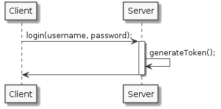

# JSON Web Token

## Estructura de un JWT

El token se parece a esto:

```javascript
eyJhbGciOiJIUzI1NiIsInR5cCI6IkpXVCJ9.
eyJzdWIiOiIxMjM0NTY3ODkwIiwibmFtZSI6IkpvaG4gRG9lIiwiYWRtaW4iOnRydWV9.
TJVA95OrM7E2cBab30RMHrHDcEfxjoYZgeFONFh7HgQ
```

Pero se puede traducir en esta estructura:

```javascript
<base64-encoded header>.<base64-encoded claims>.<base64-encoded signature>
```

El token es una tupla de 3 **json** en _base64_ que determinan el _header, claim y signature_. Y cada una de las partes esta separada por un **"."**.

## Header

```javascript
{
    "typ":"JWT",
    "alg":"HS256"
}
```

| Atributo | Definición |
|:--------:|:----------:|
| **typ** |Lo primero es el tipo de token. Por defecto vamos a usar JWT |
| **alg** |Este es el tipo de algoritmo utilizado para firmar el token.|


## Claims
El objeto Claim de JWT contiene información importante sobre el token. Por ejemplo, el username, tal vez los roles que tenga, la fecha de creación, la fecha de expiración.


```javascript
{
    "username":"aparedes",
    "roles":["dev"],
    "exp":13002131241,
    "crt":14002131241
}
```

En el ejemplo podemos visualzar campos como el nombre de usuario, los roles del usuario, la fecha de expiración del token (**exp**) y la fecha de creación del token (**crt**).

##Signature

## ¿Cómo creamos un JWT?




## Bibliografía

* [http://jwt.io/](http://jwt.io/)
* [https://developer.atlassian.com/static/connect/docs/latest/concepts/understanding-jwt.html](https://developer.atlassian.com/static/connect/docs/latest/concepts/understanding-jwt.html)
